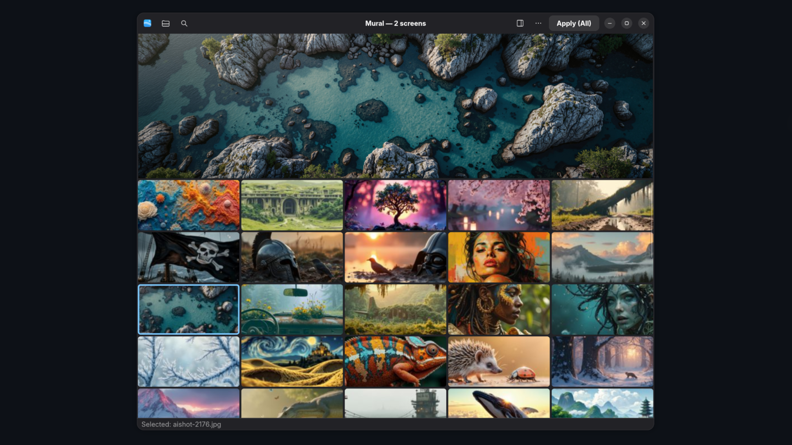

<p align="center">
  
</p>

<h1 align="center">Mural</h1>

<p align="center">
  <strong>The wallpaper manager GNOME was missing.</strong>
</p>

<p align="center">
   <a href="https://ko-fi.com/M4M51RKN7V"></a>
</p>

<p align="center">
  <a href="https://gnome.org"></a>
  <a href="https://wayland.freedesktop.org"></a>
  <a href="https://python.org"></a>
  <a href="LICENSE"></a>
</p>

---

## Demo

<p align="center">
  <a href="https://www.youtube.com/watch?v=jEkizpNf0B0">
    
  </a>
</p>

---

## What you can do with Mural

**Browse and apply**
Open a folder, scroll through thumbnails, click an image to preview it full size, then apply it. That's it.

**A different wallpaper on each screen**
Got two monitors? Pick one image for your main display, another for the second. Mural handles everything — no manual setup needed.

**Automatic slideshow**
Turn on auto-rotation and Mural will change your wallpaper every X minutes. Random or sequential, on all your screens or just some of them.

**AVIF compression** *(optional)*
Have a large collection? Mural can convert your images to AVIF and cut their file size in half — without ever touching the originals.

---

<p align="center">
  
</p>

---

## Installation

### Dependencies

```bash
# Ubuntu / Debian
sudo apt install python3-gi python3-pil gir1.2-gtk-4.0 gir1.2-adw-1

# Fedora
sudo dnf install python3-gobject python3-pillow gtk4 libadwaita

# Arch
sudo pacman -S python-gobject python-pillow gtk4 libadwaita
```

### Install

```bash
git clone https://github.com/gaorfg-bit/mural
cd mural
pip install -r requirements.txt
./install.sh
```

That's it. Mural will appear in your GNOME Activities as **Mural**. No system-wide changes — everything installs in your home folder.

### Uninstall

```bash
./uninstall.sh
```

Removes the app, icon and desktop entry. Your config and wallpaper settings are kept.

---

## Multi-monitor setup

For a different wallpaper on each screen, run this once:

```bash
gsettings set org.gnome.desktop.background picture-options spanned
```

Mural takes care of the rest.

---

## Changelog

### v1.1
- 🖥️ **Independent monitors by default** — "Same image on all" is now unchecked by default. Each monitor manages its wallpaper independently, and the preference is saved between sessions.
- 🔒 **No more overwriting** — Changing the wallpaper on one monitor no longer overwrites the other monitors' existing wallpapers.
- 🔗 **Dock icon fixed** — Mural now shows its proper icon in the taskbar instead of the generic terminal script icon.
- 🆕 **What's new dialog** — A popup shows what changed on first launch after an update. Accessible anytime from the app menu.
- 🧹 **Cleaner uninstall** — `uninstall.sh` now properly removes the icon and desktop entry so Mural disappears from the app list immediately.

---

## Compatibility

Mural works on **GNOME 46 and above**, on both Wayland and X11, with or without multiple monitors.

---

## Contributing

Got an idea, found a bug, or want to add KDE support? Issues and PRs are welcome.

---

## License

GPL-3.0 — © 2026 GaoR
